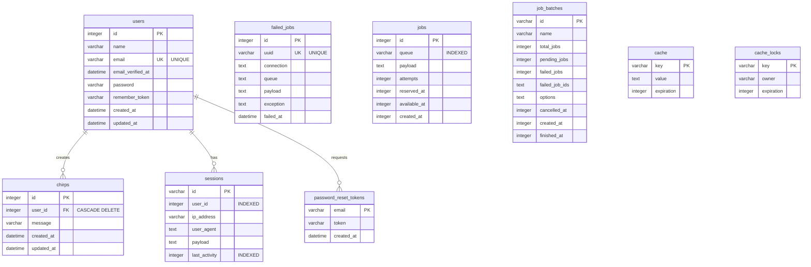

# Entity Relationship Diagram

## Database Schema Overview

## Core Business Tables

The main business logic revolves around:

- **users**: User accounts and authentication
- **chirps**: User-generated messages with foreign key relationship to users
- **sessions**: Active user sessions for authentication state
- **password_reset_tokens**: Temporary tokens for password reset flow

## Supporting Infrastructure Tables

- **jobs** / **failed_jobs** / **job_batches**: Queue system for background processing
- **cache** / **cache_locks**: Application caching layer

## Key Relationships

1. **users → chirps**: One-to-many relationship with cascade delete
2. **users → sessions**: One-to-many relationship (indexed for performance)
3. **users → password_reset_tokens**: One-to-one relationship via email

## Indexes

- `users.email`: Unique index for authentication
- `sessions.user_id`: Index for session lookups
- `sessions.last_activity`: Index for cleanup operations
- `jobs.queue`: Index for queue processing
- `failed_jobs.uuid`: Unique index for job identification
